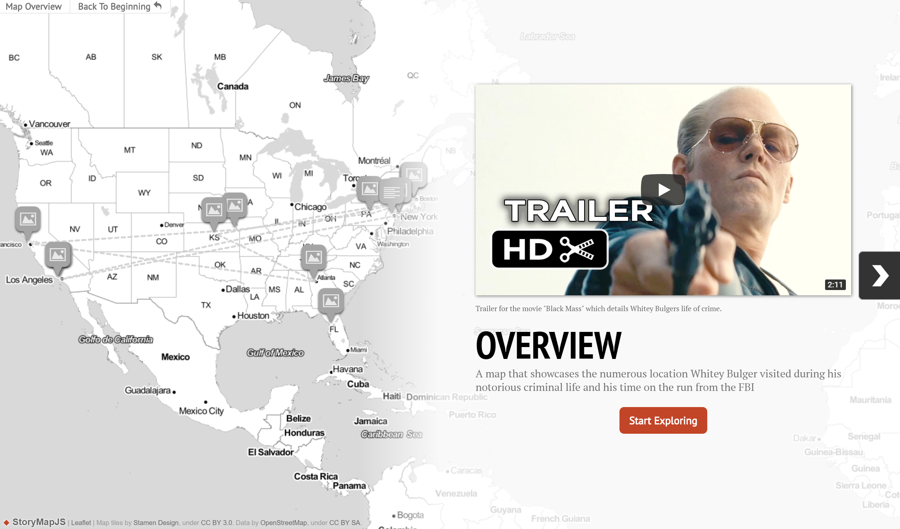

## Collaborative Project

For the collaborative project, our group decided to investigate a web software called StoryMapJS. The use of StoryMapJS is to create a narrative using geographical locations on a map. Our group tried the software and created an interactive map. It documented the locations and actions of Whitey Bulger during his crime spree. For my part of the project, I discussed the theoretical implications relating to the Digital Humanities. I related StoryMapJS to Johanna Drucker’s article, “Humanities Approaches to Graphical Displays”. Drucker discussed the use of data as visuals. She mentioned GIS, which I found to be like the interface and purpose of StorymapJS.

I try to approach collaborative projects by having good communication with my group members. I like to discuss my ideas about the project with my members before I start working and I try to converse with them as I work on it. I find a way to keep in contact with them usually through E-mail or Facebook. Usually, my groups would try to divide the project up into parts and put it together for the final rendition of the project. I communicated with my group members to discuss which parts they wish to work on. For my part of the collaboration project, I presented the theories and discussions shown [here](https://github.com/IascAtBrock/IASC-2P02-TeamPresentations/commit/502fe0d481f8ae1738c4eb466bd44d540c0cf681#diff-43022e83377c047c9a950591e63f2331). 

After the group had completed their parts individually, we reviewed what we had done and gave suggestions to improve it. I really benefit from hearing others’ ideas because it informs me on what I can improve in my work. Our group collaborated to put the final project together. For this project, we made a presentation and a story map to demonstrate what StoryMapJS can do. It was a great project to collaborate because it was a great way to hear what others think about a certain media. I enjoy hearing others’ opinions because it can help me form my own. I value group work because it creates discussions about important topics in Digital Humanities. For this project, I was able to hear my group members’ theories and opinions about StoryMapJS and tried to incorporate them with mine into the final project.
